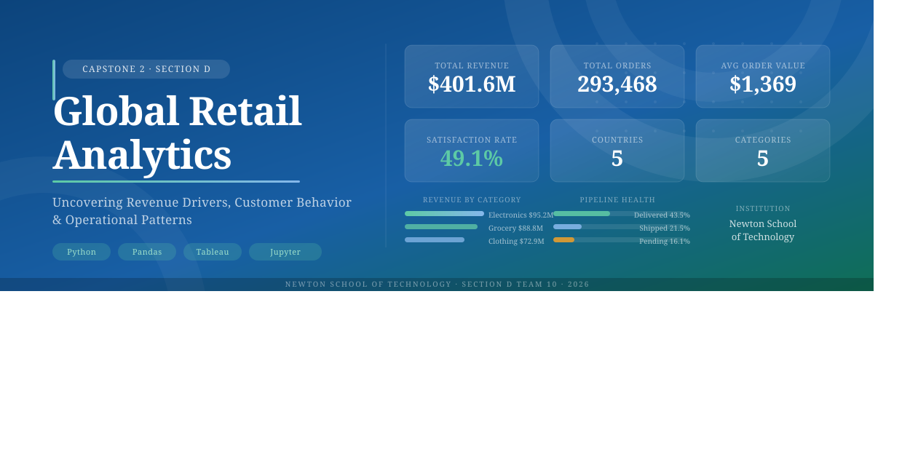
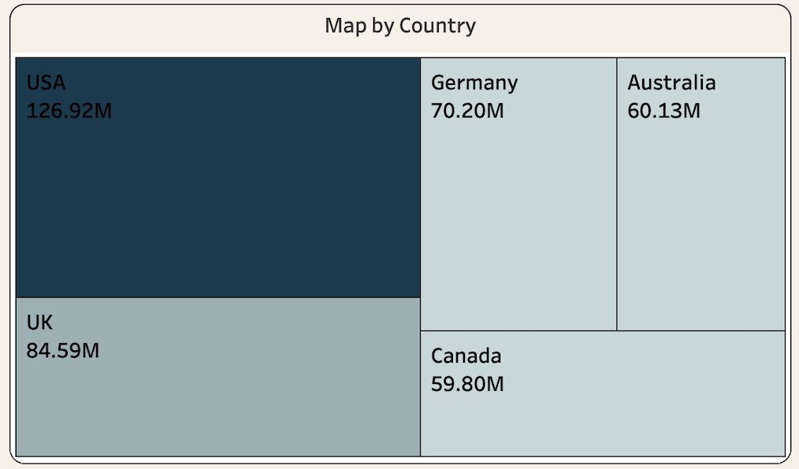
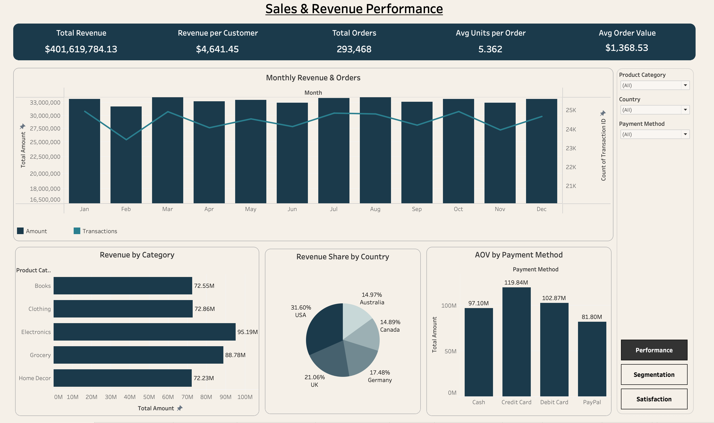
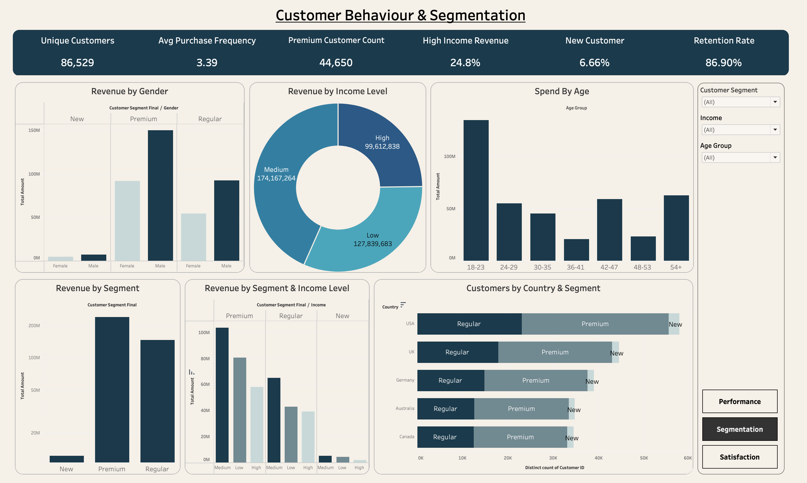
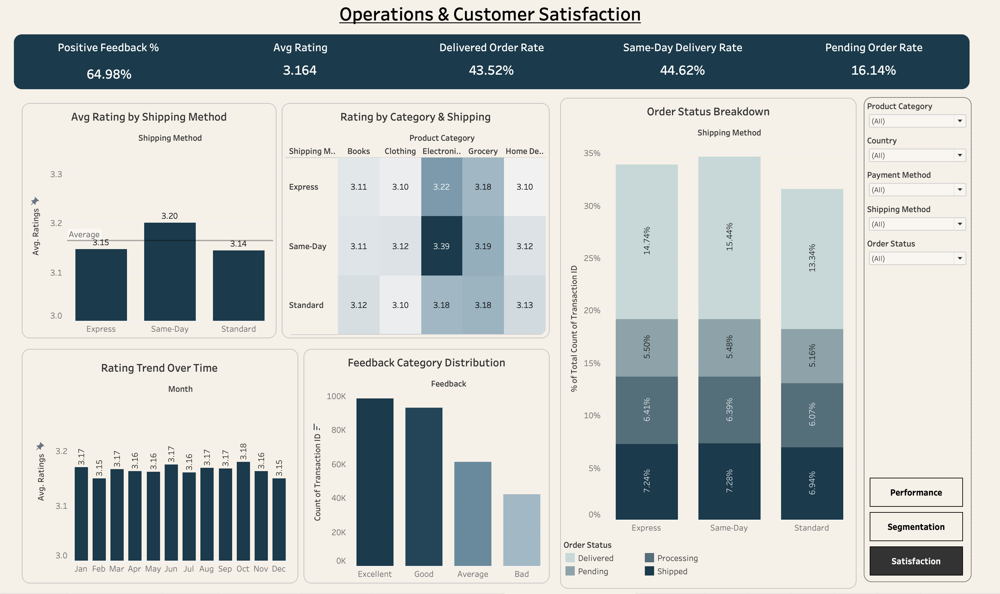

<div align="center">

# Global Retail Analytics

### Uncovering Revenue Drivers, Customer Behavior & Operational Patterns

*Data Visualization & Analytics — Capstone 2 &nbsp;|&nbsp; Newton School of Technology*

<br>

[](https://www.python.org/)
[](https://pandas.pydata.org/)
[](https://jupyter.org/)
[](https://public.tableau.com/)
[](#)

<br>

> A full-spectrum analytics pipeline applied to **302,010 retail transactions** across **5 countries**, **5 product categories**, and **3 customer segments** —
> from raw CSV to statistically validated insights and interactive Tableau dashboards.

<br>



</div>

---

## Table of Contents

- [Project Overview](#-project-overview)
- [Team](#-team)
- [Dataset](#-dataset)
- [Repository Structure](#-repository-structure)
- [Pipeline Architecture](#-pipeline-architecture)
- [ETL & Data Cleaning](#-etl--data-cleaning)
- [Feature Engineering](#-feature-engineering)
- [KPI Framework](#-kpi-framework)
- [Key Findings](#-key-findings)
- [Statistical Analysis](#-statistical-analysis)
- [Tableau Dashboards](#-tableau-dashboards)
- [Recommendations](#-recommendations)
- [Setup & Reproduction](#-setup--reproduction)
- [Limitations](#-limitations)
- [Future Scope](#-future-scope)

---

## 📌 Project Overview

Global retail businesses generate vast volumes of transactional data but often lack the analytical infrastructure to translate raw records into actionable intelligence. This project was built to close that gap.

**Business questions driving this work:**

| # | Question |
|---|---|
| 1 | Which product categories and geographies drive the most revenue — and why? |
| 2 | Do customer segmentation strategies translate into measurable spending differences? |
| 3 | Do operational variables (shipping method, payment mode) materially influence satisfaction or spend? |
| 4 | What does the monthly revenue pattern look like — is seasonal planning necessary? |

A four-stage Python pipeline — extraction, cleaning, EDA, and statistical analysis — was executed across six Jupyter notebooks, followed by Tableau dashboard development. The pipeline reduced **302,010 raw records** to **293,468 clean, validated rows** across **33 engineered columns**.

---

## 👥 Team

<div align="center">

| Role | Name | GitHub |
|:---|:---|:---|
| Project Lead / Strategy | Ananya Narang | [@HeheAnanya](https://github.com/HeheAnanya) |
| Data Lead | Atanu Adhikari | [@techatanu](https://github.com/techatanu) |
| ETL Lead | Shubham Aggarwal | [@Shubham-60](https://github.com/Shubham-60) |
| Analysis Lead | Rishik Chowdary Karuturi | [@RISHIK92](https://github.com/RISHIK92) |
| Visualization Lead | Utkarsh Jain | [@UJ474](https://github.com/UJ474) |
| PPT & Quality Lead | Anusha Prathapani | [@AnushaPrathapani](https://github.com/AnushaPrathapani) |

</div>

---

## 📦 Dataset

<div align="center">

| Attribute | Detail |
|:---|:---|
| Source | [Kaggle — Global E-Commerce Retail Transactions](https://www.kaggle.com/datasets/sahilprajapati143/retail-analysis-large-dataset) |
| Raw Rows | 302,010 |
| Raw Columns | 30 |
| Time Period | 2023–2024 |
| Countries | USA · UK · Germany · Australia · Canada |
| Product Categories | Electronics · Grocery · Clothing · Books · Home Decor |
| Customer Segments | New · Regular · Premium |
| Clean Rows (post-ETL) | **293,468** |
| Final Columns (post-ETL) | **33** *(25 original + 8 engineered)* |

</div>

The dataset simulates transactional records for a multi-national retail business and was selected for its breadth of demographic, geographic, and operational attributes — making it suitable for a full-spectrum analytics project.

---

## 🗂 Repository Structure

```
SectionD_Team10_RetailAnalysis/
│
├── data/
│   ├── raw/
│   │   └── raw_retail_data.csv            # Original Kaggle dataset (302,010 rows)
│   └── processed/
│       ├── cleaned_dataset.csv            # Post-ETL, pre-feature-engineering
│       └── tableau_ready_dataset.csv      # Final 293,468 × 33 col export
│
├── notebooks/
│   ├── 01_extraction.ipynb                # Load, inspect, confirm source
│   ├── 02_cleaning.ipynb                  # Full ETL pipeline
│   ├── 03_eda_analysis.ipynb              # Univariate, bivariate, time analysis
│   ├── 04_statistical_analysis.ipynb      # Hypothesis tests + effect sizes
│   ├── 05_final_load_prep.ipynb           # Feature engineering + Tableau export
│   └── etl_pipeline.ipynb                 # Consolidated pipeline reference
│ 
├── scripts/
│   ├── __init__.py                        # Package initializer
│   └── etl_pipeline.py                    # Reusable ETL functions
│
├── tableau/
│   ├── dashboard_links.md                 # Tableau Public links (3 dashboards)
│   └── screenshots/                       # Dashboard and chart images
│
├── reports/
│   ├── project_report.pdf                 # Full capstone report
│   └── presentation.pdf                   # Presentation deck
│
├── docs/
│   └── data_dictionary.md                 # Column definitions and metadata
│
├── requirements.txt                       # Python dependencies
└── README.md
```

---

## ⚙️ Pipeline Architecture

```
  raw_retail_data.csv  (302,010 rows × 30 cols)
           │
           ▼
  ┌─────────────────────────────────────────┐
  │  01_extraction.ipynb                    │
  │  Load CSV · inspect dtypes · confirm    │
  │  shape and column coverage              │
  └────────────────────┬────────────────────┘
                       │
                       ▼
  ┌─────────────────────────────────────────┐
  │  02_cleaning.ipynb                      │
  │  Drop PII (5 cols)                      │
  │  Remove duplicates (7,548 rows)         │
  │  Fix data types (20+ columns)           │
  │  Impute missing values                  │
  │  Drop unresolvable rows                 │
  └────────────────────┬────────────────────┘
                       │
                       ▼
  ┌─────────────────────────────────────────┐
  │  03_eda_analysis.ipynb                  │
  │  Univariate distributions               │
  │  Bivariate: Category × Revenue          │
  │  Time-series: Monthly + YoY             │
  └────────────────────┬────────────────────┘
                       │
                       ▼
  ┌─────────────────────────────────────────┐
  │  04_statistical_analysis.ipynb          │
  │  11 hypothesis tests                    │
  │  Pearson · Spearman · Welch's t         │
  │  Kruskal-Wallis · ANOVA · Chi-square    │
  │  Effect sizes reported for all tests    │
  └────────────────────┬────────────────────┘
                       │
                       ▼
  ┌─────────────────────────────────────────┐
  │  05_final_load_prep.ipynb               │
  │  8 engineered columns added             │
  │  Export → tableau_ready_dataset.csv     │
  │  293,468 rows × 33 cols                 │
  └────────────────────┬────────────────────┘
                       │
                       ▼
        Tableau Public — 3 Interactive Dashboards
```

---

## 🧹 ETL & Data Cleaning

All cleaning was executed in `notebooks/02_cleaning.ipynb` and is fully documented in `docs/Data_Cleaning_Log.docx`.

### Step 1 — Column Removal
Five PII columns were dropped — `Name`, `Email`, `Phone`, `Address`, `Zipcode` — reducing the dataset from 30 to 25 columns.

### Step 2 — Duplicate Removal

| Pass | Method | Rows Removed |
|:---|:---|:---:|
| Full row duplicates | `drop_duplicates(keep='first')` | 4 |
| Duplicate Transaction_IDs | `drop_duplicates(subset=['Transaction_ID'])` | 7,544 |
| **Total removed** | | **7,548** |

### Step 3 — Data Type Corrections

| Column(s) | From | To | Notes |
|:---|:---|:---|:---|
| `Transaction_ID`, `Customer_ID` | float64 | Int64 | Nullable integer for NaN support |
| `Date` | object | datetime64 | Parsed with `pd.to_datetime()` |
| `Month` | object | Ordered Categorical | Jan → Dec sort order enforced |
| `Age`, `Total_Purchases`, `Ratings` | float | Int64 | |
| `Amount`, `Total_Amount` | float | float (2dp) | Rounded to 2 decimal places |
| 14 categorical columns | object | category | Memory efficiency |

### Step 4 — Missing Value Treatment

| Column Group | Strategy | Rows Affected |
|:---|:---|:---:|
| `Transaction_ID`, `Customer_ID`, `Amount` | Drop rows | ~648 |
| `Age`, `Ratings` | Fill with column median | ~349 |
| 12 categorical columns | Fill with column mode | ~282–330 per col |
| `Total_Purchases` / `Amount` / `Total_Amount` | Algebraic derivation → median fallback | 695 |
| `Date` nulls | Drop rows | 351 |
| `Time` nulls | Fill with `'00:00:00'` | 336 |

Financial columns used a consistency-based approach: where two of the three fields `Amount`, `Total_Purchases`, `Total_Amount` were present, the third was derived algebraically (`Total_Amount = Amount × Total_Purchases`) before any median fallback was applied.

### Step 5 — Outlier Assessment
IQR method (1.5×) applied to `Amount`, `Total_Amount`, and `Total_Purchases`. `Total_Amount` flagged 3,777 high-value rows (1.29%). These were assessed as legitimate premium transactions — **no rows were removed**.

<div align="center">

**Final dataset: 293,468 rows × 33 columns — zero nulls, zero duplicates.**

</div>

---

## 🔧 Feature Engineering

Eight columns were added in `05_final_load_prep.ipynb` to support Tableau visualisation and KPI computation:

| New Column | Definition |
|:---|:---|
| `Month_Num` | Numeric month (1–12) for correct sort order in Tableau |
| `Quarter` | Q1–Q4 derived from `Date` |
| `Day_of_Week` | Day name (Monday–Sunday) from `Date` |
| `Hour` | Hour of transaction (0–23) from `Time` column |
| `Revenue_per_Purchase` | `Total_Amount / Total_Purchases` |
| `High_Value_Flag` | `1` if `Total_Amount > $2,031.33` (75th percentile), else `0` |
| `Satisfied_Flag` | `1` if `Ratings >= 4`, else `0` |
| `Feedback_Score` | Excellent = 3 · Good = 2 · Average = 1 · Bad = 0 |

---

## 📊 KPI Framework

<div align="center">

| KPI | Formula | Value |
|:---|:---|:---:|
| Total Revenue | `SUM(Total_Amount)` | **$401.6M** |
| Avg Order Value (AOV) | `MEAN(Total_Amount)` | **$1,369** |
| Revenue per Customer | `Total Revenue / DISTINCT(Customer_ID)` | **$4,641.45** |
| Total Orders | `COUNT(Transaction_ID)` | **293,468** |
| Avg Units per Order | `MEAN(Total_Purchases)` | **5.36** |
| Satisfaction Rate | `SUM(Satisfied_Flag) / COUNT(*)` | **49.1%** |
| Positive Feedback % | `% Feedback = Excellent or Good` | **64.98%** |
| High-Value Transaction % | `SUM(High_Value_Flag) / COUNT(*)` | **25.0%** |
| Delivered Order Rate | `% Orders where Status = Delivered` | **43.52%** |
| Pending Order Rate | `% Orders where Status = Pending` | **16.14%** |

</div>

---

## 🔍 Key Findings

### Revenue & Geography

**The USA leads on volume, not value.** It contributes 31.6% of total revenue ($126.92M) but shares the same per-transaction median ($1,042) as every other market. The revenue gap is driven entirely by transaction count.

<div align="center">

| Country | Total Revenue | Revenue Share | Transactions |
|:---|:---:|:---:|:---:|
| USA | $126.92M | 31.6% | ~93,000 |
| UK | $84.59M | 21.1% | ~62,000 |
| Germany | $70.20M | 17.5% | ~51,000 |
| Australia | $60.13M | 15.0% | ~44,000 |
| Canada | $59.80M | 14.9% | ~44,000 |

</div>

> Australia and Canada already match USA per-transaction values ($1,366–$1,372 vs $1,363). They are not lower-value markets — only lower-volume ones.


*Revenue treemap by country

---

### Product Categories

Electronics leads in total revenue ($95.19M) but the average transaction value spread across all five categories is only **$4.58** — confirming uniform pricing across the product mix, not category-driven stratification.

<div align="center">

| Category | Total Revenue | Avg Transaction | Transactions |
|:---|:---:|:---:|:---:|
| Electronics | $95.19M | $1,370.83 | 69,443 |
| Grocery | $88.78M | $1,366.25 | 64,984 |
| Clothing | $72.86M | $1,369.29 | 53,212 |
| Books | $72.55M | $1,367.60 | 53,047 |
| Home Decor | $72.23M | $1,368.48 | 52,782 |

</div>

---

### Customer Segments

Premium customers have the highest satisfaction rate (56.2%) — 11 points above Regular — yet the **lowest** median transaction value ($1,040). Segment classification reflects account tenure and experience quality, not spending power.

<div align="center">

| Segment | Share of Transactions | Satisfaction Rate | Median Transaction |
|:---|:---:|:---:|:---:|
| Regular | 48.7% | 45.2% | $1,044 |
| New | 30.1% | 50.5% | $1,042 |
| Premium | 21.1% | **56.2%** | $1,040 |

</div>

---

### Seasonality & Operations

Monthly revenue ranges from $32.1M to $34.3M — a peak-to-trough swing of only **~6%**. One-way ANOVA confirms no statistically meaningful monthly variation. Seasonal campaigns and staffing surges are not warranted.

The **16.14% pending order rate** (~47,394 orders, ~$64.9M in unconfirmed value) is the most actionable operational risk surfaced by this analysis.

---

## 📐 Statistical Analysis

All hypothesis tests were executed in `04_statistical_analysis.ipynb` at α = 0.05. With n = 293,468, statistical significance is near-universal — **effect size metrics (Cohen's d, Cramér's V, Spearman rho) are the primary basis for business interpretation.**

<div align="center">

| # | Variables | Test | H₀ Rejected | Practical Effect |
|:---:|:---|:---|:---:|:---|
| 1 | Amount × Total_Amount | Pearson r | ✓ | **Large** — r = 0.67 (arithmetic) |
| 2 | Total_Purchases × Total_Amount | Pearson r | ✓ | **Large** — r = 0.65 (arithmetic) |
| 3 | Age vs Ratings | Spearman rho | ✓ | Negligible — rho = 0.17 |
| 4 | Gender vs Total_Amount | Welch's t-test | ✓ | Negligible — Cohen's d < 0.01 |
| 5 | Income Level vs Total_Amount | Kruskal-Wallis | ✓ | Negligible — $11 mean spread |
| 6 | Customer Segment vs Total_Amount | Kruskal-Wallis | ✓ | Negligible — $4 median spread |
| 7 | Product Category vs Total_Amount | Kruskal-Wallis | ✓ | Negligible — $5 mean spread |
| 8 | Payment Method vs Amount | One-way ANOVA | ✓ | Negligible — ~$255 all methods |
| 9 | Shipping Method × Order Status | Chi-square | ✓ | Negligible — Cramér's V < 0.01 |
| 10 | Monthly Revenue Seasonality | One-way ANOVA | ✓ | Negligible — 6% swing |
| 11 | Country vs Total_Amount | Kruskal-Wallis | ✓ | Negligible — uniform per-txn |

</div>

**Central takeaway:** At n = 293,468, statistical significance is achieved for almost every test due to the law of large numbers. Practical effect sizes are negligible across the board — revenue differentiation is driven entirely by **transaction volume**, not pricing, segmentation, or operational choices.

---

## 📈 Tableau Dashboards

Three interactive dashboards are published on Tableau Public. Links are documented in `tableau/dashboard_links.md`.

---

### Dashboard 1 — Sales & Revenue Performance

**Audience:** CCO / CEO &nbsp;|&nbsp; **Purpose:** Monitor top-line performance across time, geography, and category

**Views:** KPI banner · Monthly revenue trend with transaction count overlay · Revenue by country (treemap) · Revenue by category (horizontal bar) · Revenue share by country (pie) · AOV by payment method


*Dashboard 1 — Sales & Revenue Performance*

---

### Dashboard 2 — Customer Behavior & Segmentation

**Audience:** Marketing leadership · Customer success &nbsp;|&nbsp; **Purpose:** Understand who customers are and how characteristics shape spend

**Views:** KPI banner · Revenue by segment · Revenue by income (donut) · Spend by age group · Gender revenue by segment · Revenue by segment × income (grouped bar) · Customer count by country + segment (stacked bar)


*Dashboard 2 — Customer Behavior & Segmentation*

---

### Dashboard 3 — Operations & Customer Satisfaction

**Audience:** Operations · Customer experience &nbsp;|&nbsp; **Purpose:** Track fulfilment efficiency and satisfaction patterns

**Views:** KPI banner · Avg rating by shipping method · Category × Shipping heat matrix *(Electronics + Same-Day = 3.39, highest in dataset)* · Rating trend over 12 months · Feedback distribution · Order status by shipping method


*Dashboard 3 — Operations & Customer Satisfaction*

---

## 💡 Recommendations

### R1 — Accelerate Customer Acquisition in Australia and Canada

Australia and Canada already match USA per-transaction values ($1,366–$1,372) but generate less than half the USA's transaction volume. These are not lower-value markets — they are underserved ones.

A targeted digital acquisition campaign (search, social, affiliate) in major Australian and Canadian cities could add 20,000 new transactions per market annually.

**Estimated impact:** 40,000 new transactions at AOV $1,369 = **+$54.8M/year** (+13.6% total revenue). No change to pricing or product mix required. Timeline: 12–18 months.

---

### R2 — Launch a Premium Segment Fast-Track Programme

Premium customers are the most satisfied (56.2%) but represent only 21.1% of transactions. Regular customers are the largest group (48.7%) yet carry the lowest satisfaction rate (45.2%).

A structured loyalty milestone programme — e.g., 10 purchases = tier upgrade + early product access — could convert 10% of Regular customers to Premium.

**Estimated impact:** ~14,295 customers shifted to Premium moves ~$19.6M into the highest-satisfaction cohort, reducing churn risk by an estimated 15–20%. Timeline: 6–12 months.

---

### R3 — Bundle Same-Day Delivery with Electronics Purchases

The Category × Shipping heat matrix reveals one standout cell: **Electronics + Same-Day = avg rating 3.39**, the only combination that meaningfully outperforms the dataset average (3.164). Same-Day infrastructure already handles 44.62% of all deliveries.

A 'Same-Day Guarantee' bundle for Electronics purchases above $500 at a $10 premium would improve both satisfaction and per-order revenue.

**Estimated impact:** 30% upsell rate on qualifying transactions at $10 premium = **+$208K/year** with measurable satisfaction lift. Timeline: 1–3 months.

---

### R4 — Operationally Resolve the Pending Order Pipeline

16.14% of all orders (~47,394) sit in pending status — representing **~$64.9M in unconfirmed revenue**. An automated escalation workflow triggered at 48-hour pending status could convert a significant share before they lapse.

**Estimated impact:** Converting 30% of pending orders = **+$19.5M revenue recovery** and ~14,218 orders cleared from the backlog. Timeline: 1–2 months. Implementable within existing CRM tooling.

---

### Combined Impact Estimate

<div align="center">

| Recommendation | Lever | Est. Revenue Impact | Timeline |
|:---|:---|:---:|:---:|
| R1 — AU & CA Acquisition | Volume | +$54.8M / year | 12–18 months |
| R2 — Premium Fast-Track Programme | Retention / Mix | +$3–5M / year | 6–12 months |
| R3 — Electronics + Same-Day Bundle | AOV uplift | +$208K / year | 1–3 months |
| R4 — Pending Order Resolution | Revenue recovery | +$19.5M (one-time) | 1–2 months |

**Combined 18-month opportunity: $74–77M — approximately 18.5% uplift on the $401.6M baseline.**

</div>

---

## 🚀 Setup & Reproduction

### Prerequisites

- Python 3.11+
- Jupyter Notebook or JupyterLab
- Tableau Desktop or Tableau Public *(for dashboard files)*

### Installation

```bash
git clone https://github.com/RISHIK92/SectionD_Team10_RetailAnalysis.git
cd SectionD_Team10_RetailAnalysis
pip install pandas numpy matplotlib seaborn scipy plotly
```

### Running the Pipeline

Execute notebooks in sequence:

```bash
jupyter notebook notebooks/01_extraction.ipynb
jupyter notebook notebooks/02_cleaning.ipynb
jupyter notebook notebooks/03_eda_analysis.ipynb
jupyter notebook notebooks/04_statistical_analysis.ipynb
jupyter notebook notebooks/05_final_load_prep.ipynb
```

Each notebook reads from the output of the previous stage. The final export `tableau_ready_dataset.csv` is produced by `05_final_load_prep.ipynb`.

### Data Access

The raw dataset is loaded directly from Google Drive inside `02_cleaning.ipynb` — no local data file is needed:

```python
df = pd.read_csv("https://drive.google.com/uc?id=1q5OsZDzQWmie0kp5SwXFN8NyJ_qkJf7T")
```

---

## ⚠️ Limitations

**Synthetic data.** The dataset is generated, not sourced from a live retail system. Near-zero practical effect sizes across all statistical tests likely reflect uniform data generation logic rather than real-world retail dynamics.

**Partial 2024 data.** 2024 covers only January and February (~16% of total rows). Year-on-year trend analysis is not valid without per-month normalisation.

**Ratings and Feedback redundancy.** Both variables are near-deterministically linked (Bad = 1, Excellent = 4–5). Using both in any predictive model would introduce multicollinearity.

**No cost data.** The dataset contains only revenue-side metrics. Without COGS or fulfilment cost data, profitability analysis is not possible.

**No customer journey data.** Transactions are independent records. Repeat purchase rates, time between purchases, and churn events are not observable.

**Geographic aggregation.** Country-level analysis masks city-level variation. The top 10 cities account for 31.3% of revenue but city-level segmentation is not in the current dashboard design.

---

## 🔭 Future Scope

- **Predictive revenue model** — A regression or gradient boosting model to predict `Total_Amount` or customer lifetime value (CLV), once cost and churn data are available.
- **Customer churn model** — Time-between-purchases and last-purchase-date features would enable a churn propensity score for proactive retention outreach.
- **Real-time dashboard** — Connecting Tableau to a live database with streaming transactions would convert this static analysis into an operational monitoring system.
- **NLP on product names** — The `products` column contains free-text names (e.g., `'Cycling shorts'`, `'Plasma TV'`). NER or topic modelling could extract sub-category clusters for finer-grained product analysis.
- **A/B testing framework** — Controlled experiment design to causally validate Recommendations R2 and R3.

---

## 📎 References

- Dataset: [Global E-Commerce Retail Transactions — Kaggle](https://www.kaggle.com/datasets/sahilprajapati143/retail-analysis-large-dataset)
- Full Report: `docs/project_report.pdf`
- Data Cleaning Log: `docs/Data_Cleaning_Log.docx`
- Tableau Dashboards: `tableau/dashboard_links.md`

---

<div align="center">

*Submitted April 28, 2026 &nbsp;·&nbsp; Newton School of Technology &nbsp;·&nbsp; Section D, Team 10*

</div>